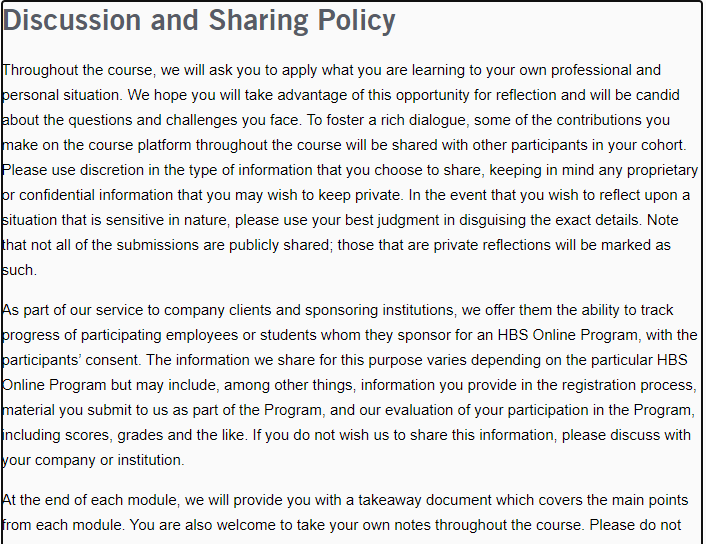

# student portfolio

Hey! Welcome to my portfolio.

It's coming up tomorrow when I Learn HTML and CSS with Tanay Pratap live on Youtube.

For now, I know:

1. JavaScript
1. Node JS
1. Repl.it
1. CHALK 

        

